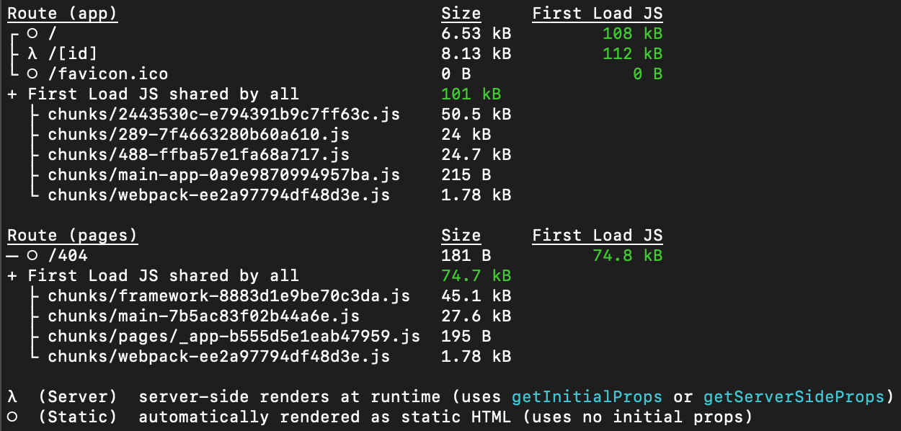

# A place to put all your relevant links

Next.js application using the latest app router with Dynamic Routes that are filled in at request time (SSR).

This demo simulates API fetch to be render as SRR. Otherwise we can just get the relative `data.json` path and use it to render as static page.

https://linkable-zeta.vercel.app

## Features

- Initial animation
- List/Grid view button on header
- Reorder list item with animation when hovering the section title

---



## Getting Started

First, run the development server:

```bash
npm run dev
# or
yarn dev
# or
pnpm dev
```

Open [http://localhost:3000](http://localhost:3000) with your browser to see the result.
